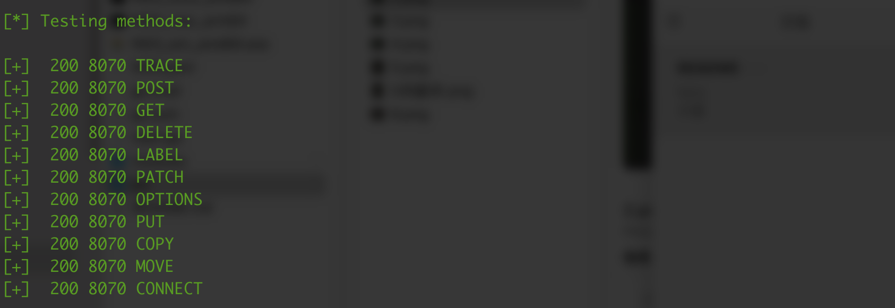
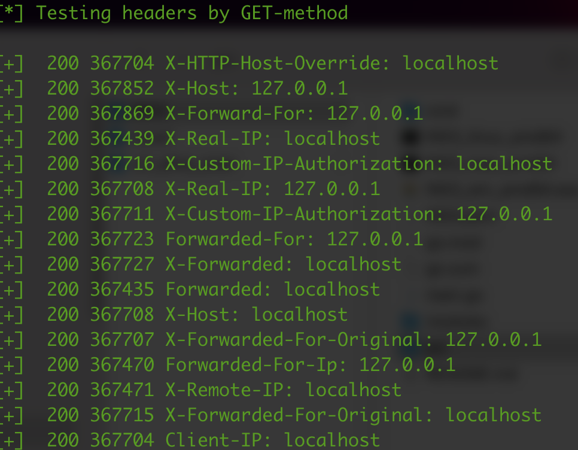
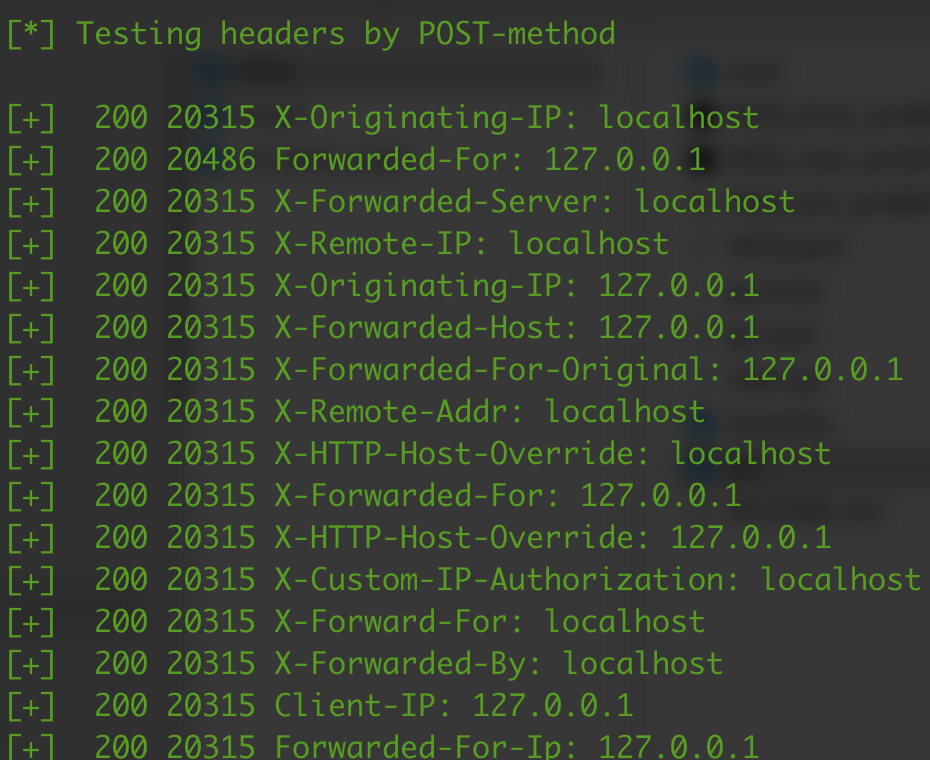
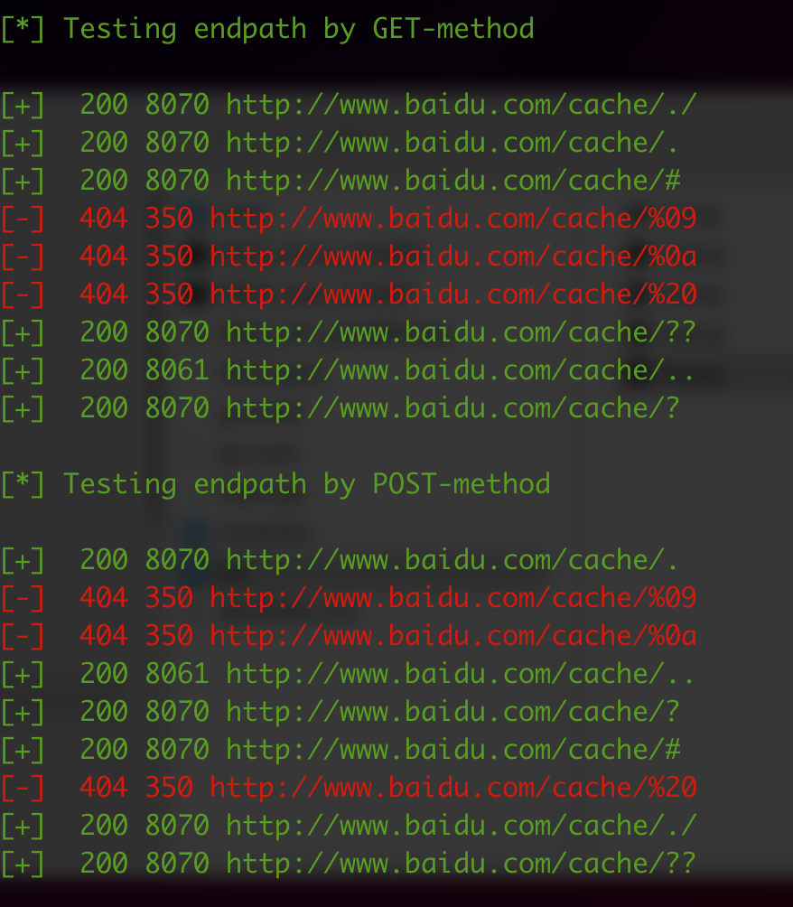
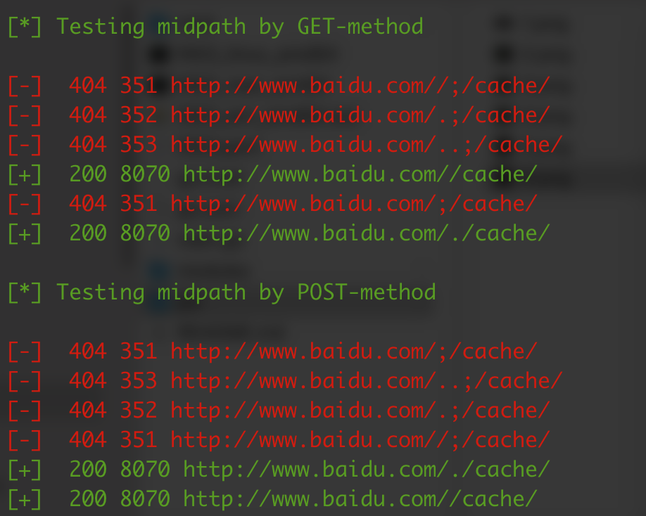
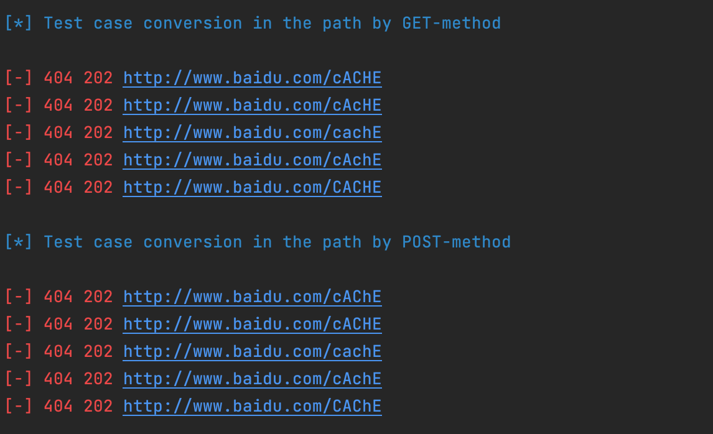
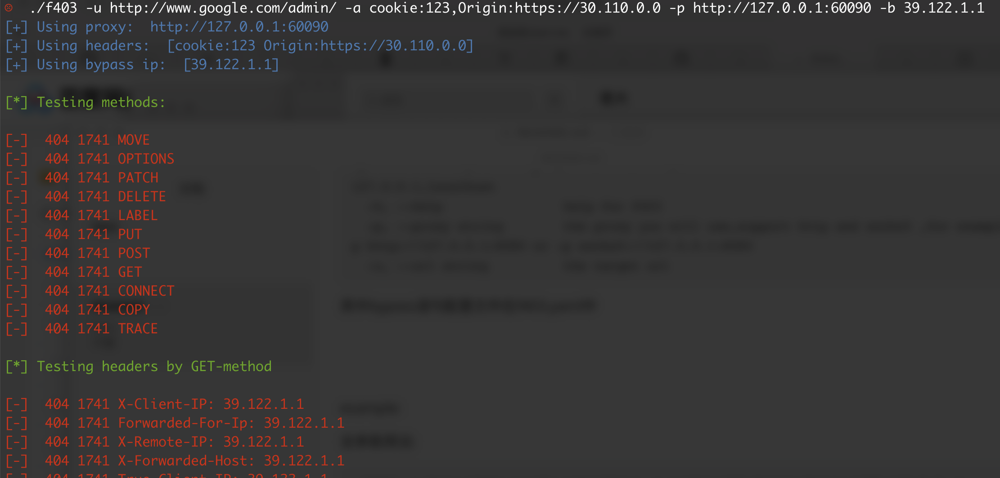

#                                  f403 

todo:
添加路径扫描
添加更多的bypass语句

已知问题：
url 后加上#号url解析失败

更新:
1. 修复一系列bug
2. 增加-d参数，可在发送post请求时添加post数据
3. 新增url path路径大小写转换fuzz

## 介绍

f403是一款用于渗透测试中对40x页面进行bypass测试的扫描工具，通过多种方式尝试绕过状态码为40x的页面，采用go编写

## 使用说明

### 参数:

```
  -a, --AddHeader strings   the headers you will add,for explame: -a 'cookie:123,Referer:https://www.baidu.com'
  -b, --bypassip strings    the ip you will add behind some header like x-client-ip: 192.168.1.1,for example,-b 192.168.1.1,30.1.1.1 and the default value 127.0.0.1,localhost
  -h, --help                help for f403
  -d, --postdata string     the post data you will add when sending post request,for expamle: -d 'username=admin&password=123456' or add json data: -d '{"username":"admin","password":"123456"}'
  -p, --proxy string        the proxy you will use,support http and socks5 ,for example: -p 'http://127.0.0.1:8080' or -p 'socks5://127.0.0.1:8080'
  -u, --url string          the target url
```


### 功能:

**其中bypass语句配置文件在f403.yaml中,可自行添加或删除，若直接下载releases，请同时手动添加f403.yaml**

1. 测试常见http方法

   

2. 添加常见的http头进行测试，分别使用GET和POST方法发送，如X-Host，X-Forward-For，X-Real-IP，Forwarded-For等

   

   

3. 在url最后添加部分字符进行测试

   

4. 在url中间添加字符进行测试

   
5. 将url中的路径进行大小写转换测试

   

#### example:

简单用法:

```
./f403 -u http://www.baidu.com/admin/
```

全参数用法:

```
./f403 -u http://www.baidu.com/asdf/admin/ -p http://127.0.0.1:8080 -a 'cookie: 123,Referer: https://www.baidu.com' -d 'admin=1&p=1' -b 1.1.1.1
```

